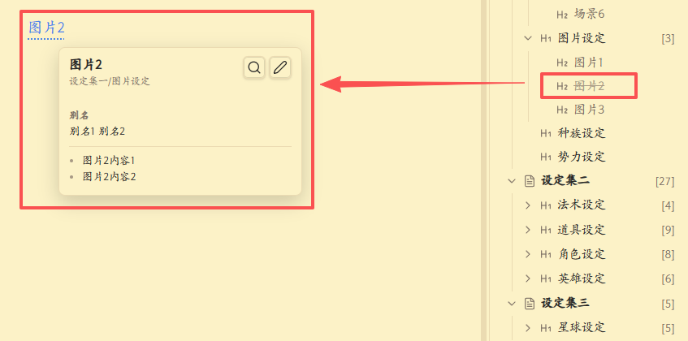
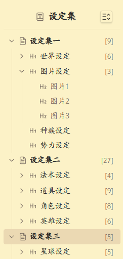
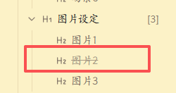

# Chinese Writer - Obsidian 插件

Obsidian下，帮助进行中文小说写作的小插件。

## 功能特性

### 一、文本关键字高亮

- **小说库与设定库对应**：
  - 配置多组"小说库 → 设定库"的对应关系
  - 在编辑小说库文件时，右侧自动显示对应的设定库内容
  - 设定库中的所有 H2 标题（关键字）会在小说文件中高亮显示



### 二、设定右边栏视图



- **三层树状结构**：
  - 第一层：设定目录下的所有 Markdown 文件
  - 第二层：每个文件中的所有 H1 标题
  - 第三层：每个 H1 下的所有 H2 标题（不包括孤立的 H2）

### 三、设定支持别名

设定可以有多个别名，设定的别名也会被高亮显示


### 四、设定支持状态

设定可以设置状态，目前支持“死亡”与“失效”两种。
在这两种状态下，该设定在右侧设定文档树会被灰化并有删除线。



### 五、中文中使用了英文标点提示
  - 常见的标点提示（逗号、句号、问号、感叹号、封号、冒号、引号）
  - 单、双引号的配对错误提示


## 安装方法

### 手动安装

1. 将插件文件夹复制到你的 Obsidian 仓库的 `.obsidian/plugins/` 目录下
2. 确保文件夹中包含以下文件：
   - `main.js`
   - `manifest.json`
   - `styles.css`
3. 在 Obsidian 中打开 **设置 → 社区插件**
4. 关闭安全模式（如果已开启）
5. 在已安装插件列表中找到 "Chinese Writer" 并启用

### 开发模式安装

1. 克隆此仓库到 `.obsidian/plugins/` 目录
2. 运行 `npm install` 安装依赖
3. 运行 `npm run dev` 启动开发模式（自动监听文件变化）
4. 或运行 `npm run build` 进行生产构建

## 使用方法

### 1. 配置文件夹对应关系

1. 打开 **设置 → Chinese Writer**
2. 在 "文件夹对应关系" 部分点击 **添加** 按钮
3. 在第一个弹出框中输入**小说库**路径（例如：`小说库`）
4. 在第二个弹出框中输入**设定库**路径（例如：`设定库`）
5. 可以添加多组对应关系
6. 点击 "删除" 按钮可以删除不需要的对应关系

**工作原理**：
- 当你打开小说库中的文件时，右侧树状视图会自动显示对应设定库的内容
- 设定库中所有 H2 标题会作为关键字，在小说文件中高亮显示
- 例如：设定库中有 `## 张三` 和 `## 李四`，这些名字在小说文件中会被高亮

### 2. 打开文档树视图

有三种方式打开视图：

1. **命令面板**：
   - 按 `Ctrl/Cmd + P` 打开命令面板
   - 输入 "打开文档树视图"
   - 选择并执行

2. **功能区图标**：
   - 点击左侧功能区的书本图标

3. **自动打开**：
   - 插件加载时会自动在右侧边栏打开视图

### 3. 使用树状视图

- **展开/折叠节点**：点击节点前的箭头图标
- **全部展开/折叠**：点击标题栏右侧的按钮
- **拖动排序**：可拖动各层级进行手动排序
- **右键菜单**：点击树状视图各层级有相应功能菜单

### 4. 自定义样式

1. 打开 **设置 → Chinese Writer**
2. 在“关键字高亮样式”部分配置高亮样式：
   - **背景色**：支持8位HEX颜色（例如 `#fff3cdff`，最后两位为透明度）
   - **下划线样式**：选择实线、虚线、点线、双线和波浪线
   - **下划线粗细**：使用滑动条调整（0-10像素）
   - **下划线颜色**：支持8位HEX颜色（例如 `#ffc107ff`）
   - **字体粗细**：选择正常或粗体
   - **字体样式**：选择正常或斜体
   - **文字颜色**：支持8位HEX颜色或 `inherit`（继承原有颜色）
3. 在“高亮悬停预览”部分配置鼠标悬停时出现的预览栏样式：
   - **预览栏宽度**：预览栏的整体宽度大小
   - **预览栏高度**：预览栏的整体高度大小
   - **预览栏下方内容行数**：预览栏下方显示的最多内容行数，超出则出现滚动条
4. 设置会实时生效

## 设定文档结构约定

为了让插件正确解析你的设定文档，请遵循以下结构：

```markdown
# 设定分类1

## 设定1

这里是设定1中的内容。
可以有多行。

## 设定2

【状态】失效
上面那行设定了状态。

# 设定分类2

## 设定3

【别名】别名1，别名2
上面那行设定了别名。
```

**注意事项**：
- 使用标准的 Markdown 标题语法（`#` 后面要有空格）
- H2 必须在 H1 下面才会被收集
- 孤立的 H2（没有上级 H1）会被忽略
- H2 下的内容会被收集，直到遇到下一个标题

## 许可证

MIT License
